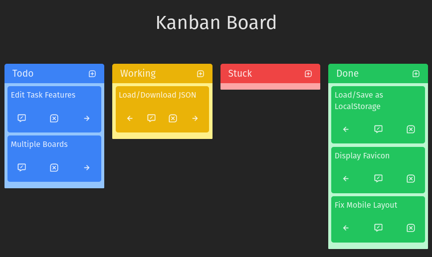

# Simple Kanban Board

## [Live Site](https://main--noahspoling-kanban.netlify.app/)

Simple Kanban is a project to create a task board that persists in the localStorage.

To run the project

    cd simple-kanban
    npm install
    vite
